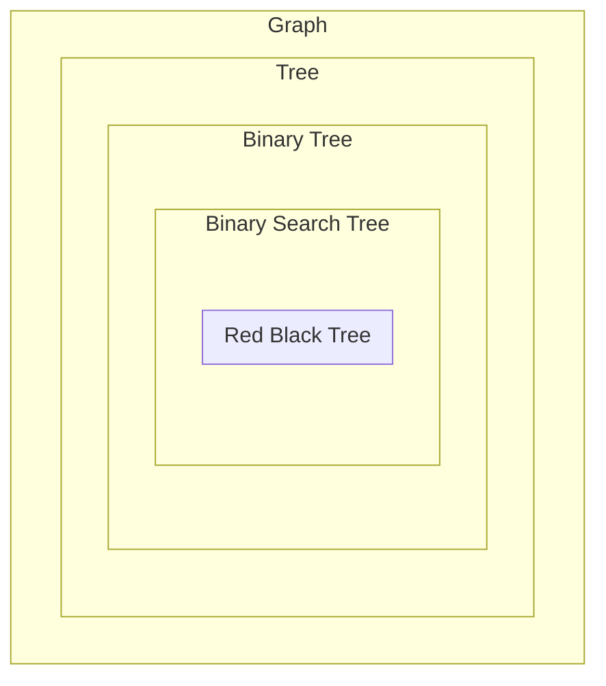

# Binary_Heap

## 建立最大二元堆疊(Max Heap)

- 對具有子節點的節點進行
  - 沒有子節點的話本身就會符合規則
  - 從最下面且具有子節點的節點向上處理
  - 目前節點, 左右節點中最大的為根節點

## 建立二元堆疊(Binary Heap)

- 給定一陣列長度為 n
  - 末端元素索引值: n-1
  - 該元素的父節點索引值: n/2 - 1
  - Heapify 複雜度: O(logN)
  - 建立二元堆疊複雜度: O(nlogN)

  ```cpp
  for(int i = len/2-1; i>=0; i--){
    Heapify(i);
  }
  ```

## 樹的簡介&定義

- Graph
  - 由 node 與 edge 組成
- Tree
  - 不能形成 cycle
  - 除了根節點外的節點都僅有一個父節點
- Binary Tree
  - 每個節點的分歧度 <= 2
- Binary Search Tree
  - 資料的插入有次序性(左小右大)
- Red Black Tree(紅黑樹，二元平衡樹)
  - 在 BST 上的每個節點添加紅或黑
  - 平衡左右兩子樹的發展
  - 避免形成斜曲二元樹



## 重點

- 集合的用途?
  - 分類，檢查某一元素有沒有出現過
- Disjoint Sets 與一般集合差在哪?
  - 集合內的資料可以重複，不同集合內的元素可以重複出現。
  - 併查級的資料只允許存在一個併查集裡
- 進行 Collapsing 的目的為何
  - 為了每次查詢時不用一直重複往上，可以讓最下面的元素直接指到根節點
- 併查集合併集合時要進行何種操作?
  - 讓資料少的去接到資料多的根節點，並修改集合個數
- Map 與 Set 差異在哪?
  - Map 是映射關係，Key-Value 的對應。Set 存放 Value。資料不能重複
- Set 與 Multiset 差異在哪?
  - Set 資料不可重複，Multiset 資料可以重複
