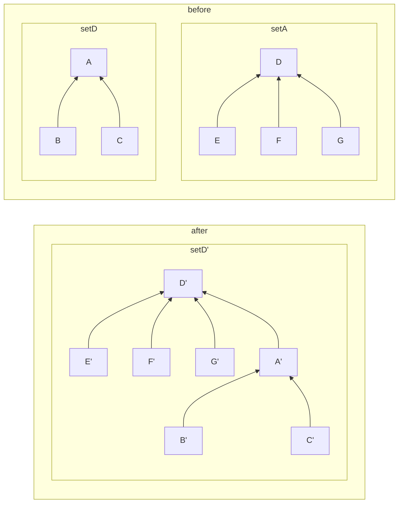

# Set

## 集合簡介

- 集合在程式中是一種抽象資料型別
- 概念源自數學的「集合論」
- 滿足三特性:
  - 無序性: 集合內每個元素之間沒有次序或長幼關係
    - 但實作時仍可定義次序關係，讓元素間照次序排列
  - 互異性: 集合內任兩個元素都不相同，每個元素只能出現一次
    - 如果需要處理同一元素出現多次的情形，使用多重集合
  - 確定性: 某元素是否屬於特定集合，只有是或不是兩種答案

## Disjoint Sets(併查集)

- 所有不同集合間的元素都相異
  - 任兩集合的交集為空集合
  - 每個集合都有一個代表，一筆資料也只屬於一個集合
- 操作複雜度(陣列)
  - 新增, 查詢, 刪除: O(1)
  - 把元素1加入集合: 把元素的集合資訊指到最底
  - 把A集合加入D集合: 把A集合的代表指向B集合



## STL

- unordered_map, unordered_set 是 hash table
  - 沒有次序關係
  - 插入, 搜尋, 刪除: O(1)
- map, set 是紅黑樹
  - 有次序，依照左右節點區分
  - 不能重複
  - 插入, 搜尋, 刪除: O(logN)
- multimap, multiset 是紅黑樹
  - 有次序，依照左右節點區分
  - 可以重複
  - 插入, 搜尋, 刪除: O(logN)

## set vs unordered_set

- set
  - `#include <set>`
  - 原理: 紅黑樹
  - 優: 有次序
  - 缺: 占用多的空間
  - 速度: 較慢, O(logN)
  - 適用: 有順序要求的資料
- unordered_set
  - `#include <unordered_set>`
  - 原理: 雜湊表
  - 優: 速度快
  - 缺: 資料沒有次序, 空間需求更大
  - 速度: 較快, O(1)
  - 適用: 沒有次序的資料

## C++ STL 裡的 set

- insert(x) 把資料放進集合
- erase(x) 把資料從集合中移除
- count(x) 檢查資料是否有在集合中, 1代表有, 0代表無
- clear() 清空集合
- 跑遍資料

  ```cpp
  for(auto it=s.begin(); it != s.end(); it++)
    cout << *it << endl;
  ```

- 找尋資料

  ```cpp
  if(s.find(data) != s.end())
    cout << "Found" << endl;
  else
    cout << "Not Found" << endl;
  ```

- Set 特殊用法
  - 宣告時可指定排序方式，預設是 less 或升冪
  - unordered_set 無此用法

  ```cpp
  set<int> s;
  for(int i = 0; i < 5; i++)
    s.insert(i);
    
  for(auto it=s.begin(); it != s.end(); it++)
    cout << *it << " "; // 0 1 2 3 4 5

  set<int, greater<int>> s2;
  for(int i = 0; i < 5; i++)
    s2.insert(i);
    
  for(auto it=s2.begin(); it != s2.end(); it++)
    cout << *it << " "; // 5 4 3 2 1 0
  ```

  - `upper_bound(x)`: 回傳大於 x 的迭代器
  - `lower_bound(x)`: 回傳不小於 x 的迭代器

  ```text
          lower_bound(begin(), end(), 3)
          ↓
  -4 -1 2 3 3 3 5 5 6 7
                ↑
                upper_bound(begin(), end(), 3)
  ```

## unordered map & set

- 沒有支援迭代器運算(++, --)
- 也沒有 upper_bound 或 lower_bound
- 但可使用 ranged based for loop 取出資料

  ```cpp
  for(auto it: unordered_set/unordered_map)
    // Do something
  ```

## Set & multiset

- Map/Set 不允許插入重複的資料
- Multimap/Multiset 允許插入重複的資料
  - `#include <map>`
  - 插入的資料會以二元平衡樹儲存
  - 可以保障順序姓
  - 新增, 查詢, 刪除: O(logN)
  - 可以當作陣列使用, 但Multimap不支援下標存取
  - 嚴格說 multiset 並非集合

  |                   | map            | set            | unordered_map | unordered_set |
  | ----------------- | -------------- | -------------- | ------------- | ------------- |
  | save data         | key->value     | value          | key->value    | value         |
  | data structure    | red black tree | red black tree | hash table    | hash table    |
  | insert complexity | O(logN)        | O(logN)        | O(1)          | O(1)          |
  | delete complexity | O(logN)        | O(logN)        | O(1)          | O(1)          |
  | search complexity | O(logN)        | O(logN)        | O(1)          | O(1)          |
  | ordered           | Y              | Y              | N             | N             |
  | moved by iterator | Y              | Y              | N             | N             |
  | duplicate data    | N              | N              | N             | N             |
  - 
  |                   | multimap       | multiset       | unordered multimap | unordered multiset |
  | ----------------- | -------------- | -------------- | ------------------ | ------------------ |
  | save data         | key->value     | value          | key->value         | value              |
  | data structure    | red black tree | red black tree | hash table         | hash table         |
  | insert complexity | O(logN)        | O(logN)        | O(1)               | O(1)               |
  | delete complexity | O(logN)        | O(logN)        | O(1)               | O(1)               |
  | search complexity | O(logN)        | O(logN)        | O(1)               | O(1)               |
  | ordered           | Y              | Y              | N                  | N                  |
  | moved by iterator | Y              | Y              | N                  | N                  |
  | duplicate data    | Y              | Y              | Y                  | Y                  |

  - <input type="checkbox" id="name" name="name"/>