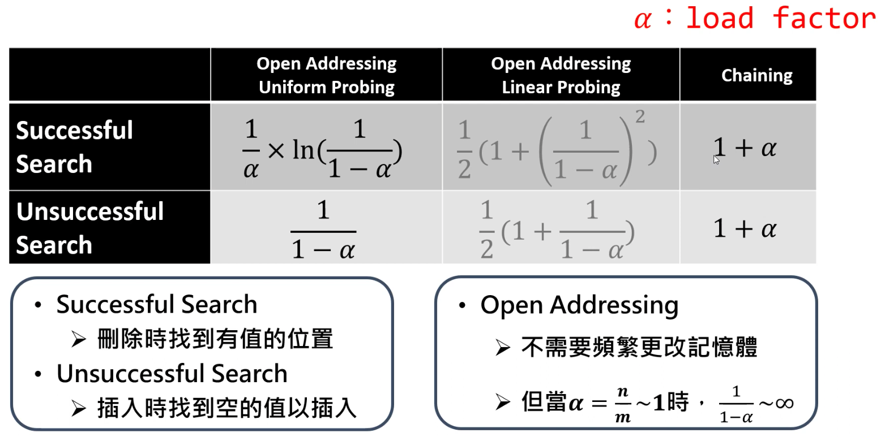

# UnorderedMap

## 碰撞(Collision 處理)

- load factor(α): n/m
- 當 n>>m, 極容易發生碰撞
- Open Addressing
  - 當此處已滿，就尋找下一個空位
  - i: 碰撞次數
  - Linear Probing: 逐步加 i 個位置線性尋找空位
    - `hash(key, i) = hash(key, 0) + i) % m`
    - e.g. 0, 1, 2, 3, 4, 5...
  - Quadratic Probing: 逐步加 a*i^2+b*i 個位置尋找空位
    - `hash(key, i) = hash(key, 0) + a*i^2 + b*i) % m`
    - e.g. 0, 3, 6, 11, 18, 27...for a = 1, b = 2
    - 問題: a, b 不易取
  - Double Hashing
    - `hash(key, i) = hash(key, 0) + i * hash2(key)) % m`
  - Perfect hashing
    - 利用兩次 Universal hashing
      - Universal hashing
        - 隨機挑選哈希函式
        - 同樣的鍵值可以能對應不同的索引值
        - 碰撞的機率固定在 n/m
      - 第一次 hash 到的是另一個 hash table
      - 第二次 hash 到的才是真正的 value
    - 用兩個雜湊表拼出一個雜湊表
    - 時間複雜度 worst case: O(1)
    - 空間複雜度，透過挑選適合的 hash function, 可達到 worst case: O(1)
  - Chaining
    - 在 array 中使用 linked list 連結碰撞
    - 時間複雜度
      - worst case: O(n)
        - 所有的 key 都被放在同一個索引值
        - 等同於 linked list
      - average case: O(1+α)
        - α 是平均在一個索引值的資料個數
- 避免碰撞
  - 因鍵值未知，故碰撞無法完全避免
  - 使用 multiplication 而非 division
  - 減少碰撞次數可以提升效能
  

## Rehashing

- 當不斷塞入資料導致原有的 hash table 過小
  - 碰撞不停發生
  - slot 被塞入許多資料，造成效率不佳
- 重新配置 hash table 大小
  - 把大小擴增為原有的兩倍
  - 再把資料重新 hash 後移入

## Map 與 Set 的差異

- Map:
  - Key -> Value
  - 資料結構：雜湊表或紅黑樹
  - 常用來儲存對應關係
- Set:
  - Value
  - 資料結構：雜湊表或紅黑樹
  - 常用來分群，紀錄出現與否

## Map 與 Dict

- C++
  - unordered_map
    - `#include <unordered_map>`
    - 雜湊表(hash table)
    - 插入，搜尋，刪除: O(1)
    - 優：速度快
    - 缺：沒有排序資料，空間需求更大
    - 適用沒有次序的資料
  - map
    - `#include <map>`
    - 紅黑樹(red-black tree)
    - 插入，搜尋，刪除: O(logN)
    - 優：有次序
    - 缺：佔用較多的空間
    - 適用有順序要求的資料
- Python
  - dict() 是 hash table

## 架構

```cpp
// 函式庫
#include <map>
#include <unordered_map>

// 宣告
map<datatype1, datatype2> map_name;
unordered_map<datatype1, datatype2> map_name;

// 迭代器
map<datatype1, datatype2>::iterator iter;
unordered_map<datatype1, datatype2>::iterator iter;

// 新增
map_name.insert(pair<datatype, datatype2>(Key, Value));
map_name[Key] = Value;

// 搜尋
iter = map_name.find(Key);
if(iter != map_name.end()){
  cout << "Value: " << iter->second << endl;
else
  cout << "Nod found key!" << endl;
}

// 刪除特定項
iter = map_name.find(Key);
map_name.erase(iter);
bool flag = map_name.erase(Key);

// 全部清空
map_name.erase(map_name.begin(), map_name.end());
map_name.clear();

// 判斷是否為空
flag = map_name.empty();

// 取出所有資料
for(auto& element: map_name){
  cout << "Key: " << element.first << ", Value: " << element.second << endl;
}

// 重新設定雜湊表的槽樹並搬遷資料
map_name.rehash(Length);

// 擴充容量，確保在該容量前不需搬遷資料
map_name.reserve(Length);

// 取出雜湊函示的函示指標
auto hash_func = map_name.hash_function();

// 取出比較 key 的函示指標
auto key_eq_func = map_name.key_eq();
```

## 語法
